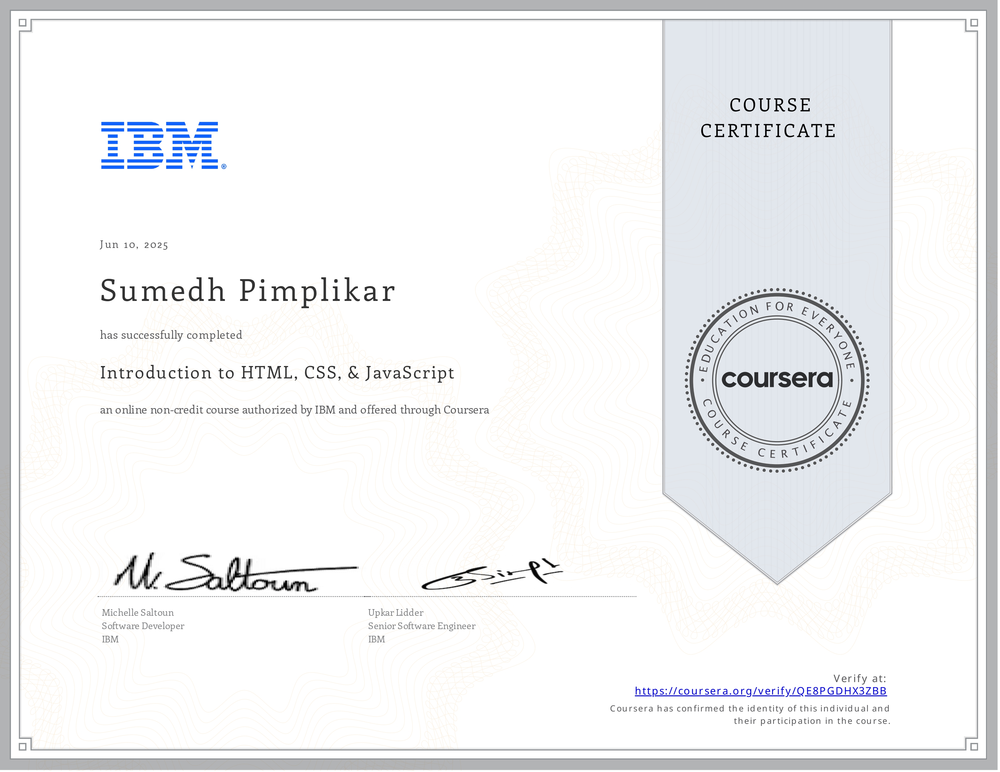

<!-- TITLE with Animated Typing Effect -->

  

  

---

 

Welcome to my Certificates & Badges repository!  
Here you'll find a curated collection of all my verified certificates, completed course badges, workshop participations, and other achievements from various platforms and institutions.

This repo serves as a **central archive** for:

- ✅ Technical certifications 
- 🧠 Learning milestones and badges from platforms like Coursera, Udemy, NPTEL, and more
- 🏅 Events, hackathons, workshops, and seminars I’ve been part of
- 🎯 Self-paced learning progress

---

  <table>
    <tr>
      <td align="center" width="500" >
         
      </td>
      <td align="center" width="500" >
         
      </td>
       <td align="center" width="500" >
          
      </td>
      <td align="center" width="500">
         
      </td>
      <td align="center" width="500" >
          
      </td>
    </tr>
     <tr>
      <td align="center" width="500" >
          
      </td>
       <td align="center" width="500" >
          
      </td>
      <td align="center" width="500">
           
      </td>
        <td align="center" width="500" >
           
      </td>
       <td align="center" width="500" >
           
      </td>
    </tr>
    <tr>      
       <td align="center" width="500" >
      </td>
       <td align="center" width="500" >
           
      </td>
       <td align="center" width="500" >
           
      </td>
       <td align="center" width="500" >
         
      </td>
       <td align="center" width="500" >
      </td>
    </tr>
    
   
  </table>

 

  

---
<!-- Visually Centered Certificate Table -->

  <table>
    <tr>
      <td align="center" width="500" height="300">
         
      </td>
      <td align="center" width="500" height="300">
         
      </td>
    </tr>
    <tr>
      <td align="center" width="500" height="300">
         
      </td>
      <td align="center" width="400">
         
      </td>
    </tr>
     <tr>
      <td align="center" width="500" height="300">
         
      </td>
      <td align="center" width="500" height="300">
         
      </td>
    </tr>
     <tr>
      <td align="center" width="500" height="300">
         
      </td>
      <td align="center" width="500" height="300">
         
      </td>
    </tr>
     <tr>
      <td align="center" width="500" height="300">
         
      </td>
      <td align="center" width="500" height="300">
         
      </td>
    </tr>
     <tr>
      <td align="center" width="500" height="300">
         
      </td>
      <td align="center" width="500" height="300">
         
      </td>
    </tr>
     <tr>
      <td align="center" width="500" height="300">
         
      </td>
      <td align="center" width="500" height="300">
         
      </td>
    </tr>
     <tr>
      <td align="center" width="500" height="300">
         
      </td>
      <td align="center" width="500" height="300">
         
      </td>
    </tr>
    <tr>
      <td align="center" width="500" height="300">
         
      </td>
      <td align="center" width="500" height="300">
         
      </td>
    </tr>
    <tr>
      <td align="center" width="500" height="300">
         
      </td>
      <td align="center" width="500" height="300">
         
      </td>
    </tr>
    <tr>
      <td align="center" width="500" height="300">
         
      </td>
      <td align="center" width="500" height="300">
         
      </td>
    </tr>
     <tr>
      <td align="center" width="500" height="300">
         
      </td>
      <td align="center" width="500" height="300">
         
      </td>
    </tr>
    <tr>
     <tr>
      <td align="center" width="500" height="300">
         
      </td>
      <td align="center" width="500" height="300">
         
      </td>
    </tr>
    <tr>
      <td align="center" width="500" height="300">
         
      </td>
      <td align="center" width="500" height="300">
         
      </td>
    </tr>
    <tr>
      <td align="center" width="500" height="300">
         
      </td>
      <td align="center" width="500" height="300">
         
      </td>
    </tr>
     <tr>
      <td align="center" width="500" height="300">
         
      </td>
      <td align="center" width="500" height="300">
         
      </td>
    </tr>
     <tr>
      <td align="center" width="500" height="300">
         
      </td>
      <td align="center" width="500" height="300">
         
      </td>
    </tr>
     <tr>
      <td align="center" width="500" height="300">
         
      </td>
      <td align="center" width="500" height="300">
         
      </td>
    </tr>
     <tr>
      <td align="center" width="500" height="300">
         
      </td>
      <td align="center" width="500" height="300">
         
      </td>
    </tr>
    <tr>
      <td align="center" width="500" height="300">
         
      </td>
      <td align="center" width="500" height="300">
         
      </td>
    </tr>
    <tr>
      <td align="center" width="500" height="300">
         
      </td>
      <td align="center" width="500" height="300">
         
      </td>
    </tr>
     <tr>
      <td align="center" width="500" height="300">
         
      </td>
      <td align="center" width="500" height="300">
         
      </td>
    </tr>
     <tr>
      <td align="center" width="500" height="300">
         
      </td>
      <td align="center" width="500" height="300">
         
      </td>
    </tr>
  </table>

  

  
 

---

  <i>Thanks for stopping by!</i>  
   
  <b>Feel free to explore, verify, and get inspired!</b>

